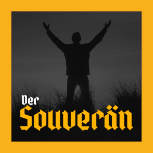

_Deutsche Übersetzung [hier](./README.md)_

# The Sovereign

The `Sovereign` embodies the concept of an autonomous and self-determined individual. He is a person who is able to make his own decisions, independent of external influences or opinions of others. The Sovereign possesses an inner strength and clarity to find his own way and pursue his goals.
 
An essential component of sovereignty is the ability to self-reflect. The `Sovereign` is able to look critically at his own thoughts, emotions and actions and to question them. He is aware of his own strengths and weaknesses and uses this knowledge to continuously develop and grow.

The `Sovereign` is characterized by a high level of self-responsibility. He takes full responsibility for his life and his decisions. He recognizes that he is the main actor of his own destiny and that he has the power to bring about change.

The `Sovereign` is not discouraged by external circumstances, but accepts the challenges and finds solutions.

The `Sovereign` has the ability to set boundaries. He recognizes his own needs, values and boundaries and sets them clearly and respectfully towards others. He does not allow himself to be manipulated or influenced by others, but remains steadfast in his convictions and decisions.

In addition to self-determination and autonomy, the `Sovereign` values the freedom of other people. He recognizes that every person has the right to lead his own life and make his own decisions.

The `Sovereign` respects the individuality and diversity of the people around him and promotes a climate of mutual respect and cooperation.

The `Sovereign` recognizes the need for peaceful cooperation with fellow human beings and strives to create a positive coercion-free environment in which free people want to live and grow together.

Egoism is alien to him as an expression of personal insecurity and distrust in people.

Overall, the `Sovereign` is a symbol of personal strength, self-responsibility, self-determination and respect. He is a person who is able to find his own way in a complex and ever-changing world while maintaining his integrity and authenticity.

The `Sovereign` inspires others by his example and contributes to building a society characterized by freedom and justice.

### Source

Podcast "Der Souverän" by [Die Marktradikalen](https://www.die-marktradikalen.cc).

Listen to (_in German only_):
- [Fountain](https://fountain.fm/episode/Kx4taG3LBdAAOQ4K6uzk)
- [Youtube](https://www.youtube.com/watch?v=iN6MXDCeGg8)
- [Spotify](https://open.spotify.com/episode/34oZsV364Ssigv6D0zr8VZ)
- [Odysee](https://odysee.com/@DieMarktradikalen:d/der-souveraen:f)
- [Apple Podcast](https://podcasts.apple.com/de/podcast/der-souver%C3%A4n/id1659240690?i=1000622952160)
- [Google Podcast](https://podcasts.google.com/feed/aHR0cHM6Ly9hbmNob3IuZm0vcy9kNGRlZDA0NC9wb2RjYXN0L3Jzcw/episode/Y2E3NGVhYzctNzUzNy00Y2E0LTlkNTQtNWQxODE2NjhkNzAz?sa=X&ved=0CAUQkfYCahcKEwiImMjX6PSAAxUAAAAAHQAAAAAQAg)
